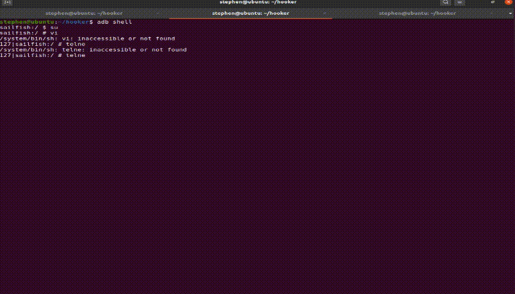
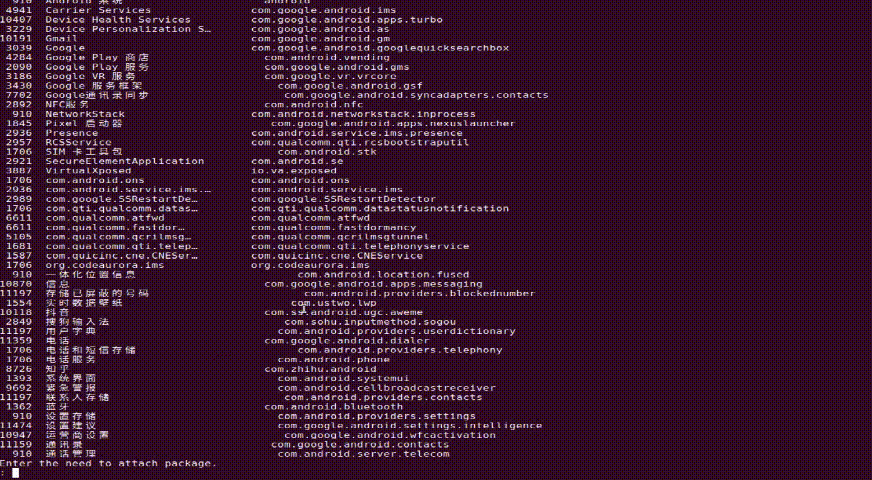

### 欢迎使用hooker逆向工作台

## hooker简介
- hooker是一个站在Android应用开发工程师的角度打造的适用于Android逆向工程人员和安全研究人员的工具包。为逆向开发人员提供自动化生成frida的hook脚本、内存探测java类、检测activity和service和其他任意对象。
	
	
#### hooker和frida、objection有什么不同？
- 职责不同：frida注重打造调试引擎、objection注重将frida的api简单封装一下让你好快速上手frida。而hooker是重新站在一个安卓应用开发和安卓逆向工程师的角度去打造的更加专业Android逆向工作台，重新定义了逆向android的工作方式。
- 封装不同：frida是基于gumjs（V8）、C/C++封装的调试引擎，用于动态Hook跟踪、拦截和主动调用函数等。hooker是基于frida作为引擎和自己打造的Dex库（radar）调用Android Framework层代码完成的。
- 交互方式不一样：frida和objection只有atcth上才能操作各种指令，而hooker提供shell命令行交互式让你可以通过jadx进行动静结合分析。
- 更注提供重Android逆向思路和线索：frida和objection基于没有对任何Android Freamwork层的hook和能主动调用代码点位进行封装，这使得没有Android应用开发的人难以有逆向思路。而hooker的几乎所有命令都是围绕Android Freamwork进行封装，让一个即使没有Android开发经验的人也能快速找到逆向分析思路。
- hook脚本产出方式不一样：frida你需要先进行很多语法方面的学习，才能完成对各种类的各种方法进行frida脚本的编写。hooker不需要你了解frida语法细节，比如你只需通过j okhttp3.OkHttpClient:newCall 就可以生成一个hook okhttp3.OkHttpClient类的newCall方法的脚本, 即使对于任何一个被混淆的类操作也是如此。（你应该把更多的时间和精力放在逆向思路上，而不是熟悉某些语法上。）
- 提供操作原生AndroidUI功能：你可以./attch每个app目录下的android_ui.js脚本，它提供了通过ViewId、ViewText找到Android原生的View并点击，或者你想强制打开某个Activity（比如某个界面只有会员才能进入，这时候你就可以采用Android"原生代码"打开的方式）。

#### 快速开始
```shell
stephen@ubuntu:~/hooker$ git https://github.com/CreditTone/hooker.git
stephen@ubuntu:~/hooker$ cd hooker
stephen@ubuntu:~/hooker$ ls
colorful.py                 com.mokee.aegis              mobile-deploy.tar
com.alibaba.wireless        com.sankuai.meituan          org.mokee.lawnchair
com.changba                 com.sdiread.kt.ktandroid     org.mokee.weatherservice
com.google.android.youtube  com.smile.gifmaker           __pycache__
com.jifen.qukan             com.ss.android.article.news  radar.dex
com.jzg.jzgoto.phone        com.ss.android.ugc.aweme     README.md
com.koudai.weidian.buyer    com.tencent.karaoke          run_env.py
com.kugou.shiqutouch        com.tencent.mm               sogou.mobile.explorer
com.lululemon.shop          hooker                       spider.py
com.meicai.mall             hooker.py                    traceJNI
com.meitu.meipaimv          js                           xapk
com.miui.screenrecorder     mobile-deploy.sh             xinitdeploy.py
```

#### 手机连接adb
```shell
stephen@ubuntu:~/hooker$ adb devices
List of devices attached
FA77C0301476	device
```


#### 部署(如果你的手机已经启动了frida-server，可以忽略这步)
```shell
#以piexl2为例
stephen@ubuntu:~/hooker$ adb push mobile-deploy/ /sdcard/
stephen@ubuntu:~/hooker$ adb shell #进入手机命令行界面
sailfish:/ $ su #进入root权限命令行模式
sailfish:/ $ sh /sdcard/mobile-deploy/deploy.sh                                                            
disable android firewall.
start frida-server
start network adb.
deploy successfull.
stephen@ubuntu:~/hooker$ #如果你看到你的adb命令被弹出来了，表示已经正常部署。
```
##### 部署演示

***

##### 部署完成之后你的手机将发生一下几件事情
- 1.关闭iptables防火墙，解决部分手机默认防火墙开启的问题
- 2.启动frida-server，如果你的手机是arm64他将优先启动arm64位的frida-server
- 3.在/data/mobile-deploy目录生成tools_env.rc 当你有内网穿透和网络服务转发、编辑文件、检测网络方面的需求时可以执行source /data/mobile-deploy/tools_env.rc，它将临时生成vi、telnet、frpc、tcpforward、ll命令以便你进行更便捷的开发，如图

***
- 4.启动网络adb，即你可以直接通过远程adb调试手机。例如:adb connect 192.168.0.105

***


#### 查看当前所有可调试进程
```shell
stephen@ubuntu:~/hooker$ ./hooker 
  PID  Name                           Identifier                                                   
-----  -----------------------------  -------------------------------------------------------------
 2857  Android Auto                   com.google.android.projection.gearhead                       
 1779  Android Services Library       com.google.android.ext.services                              
  929  Android 系统                     android                                                      
 5073  Carrier Services               com.google.android.ims                                       
11051  Device Health Services         com.google.android.apps.turbo                                
 2913  Device Personalization S…      com.google.android.as                                        
 2522  Google                         com.google.android.googlequicksearchbox                      
15189  Google Play 商店                 com.android.vending                                          
 2101  Google Play 服务                 com.google.android.gms                                       
 2833  Google VR 服务                   com.google.vr.vrcore                                         
 7710  Google 服务框架                    com.google.android.gsf                                       
 2546  NFC服务                          com.android.nfc                                              
  929  NetworkStack                   com.android.networkstack.inprocess                                                                   
  929  一体化位置信息                        com.android.location.fused                                   
14468  云端硬盘                           com.google.android.apps.docs                                 
14403  信息                             com.google.android.apps.messaging                            
12073  存储已屏蔽的号码                       com.android.providers.blockednumber                          
 1574  实时数据壁纸                         com.ustwo.lwp                                                
15637  抖音                             com.ss.android.ugc.aweme                                     
 2480  搜狗输入法                          com.sohu.inputmethod.sogou                                   
12073  用户字典                           com.android.providers.userdictionary                         
13362  电话                             com.google.android.dialer                                    
 1704  电话和短信存储                        com.android.providers.telephony                              
 1704  电话服务                           com.android.phone                                            
11818  知乎                             com.zhihu.android                                            
 1451  系统界面                           com.android.systemui                                         
12424  紧急警报                           com.android.cellbroadcastreceiver                            
12073  联系人存储                          com.android.providers.contacts                               
 1431  蓝牙                             com.android.bluetooth                                        
  929  设置存储                           com.android.providers.settings                               
10149  运营商设置                          com.google.android.wfcactivation                             
14376  通讯录                            com.google.android.contacts                                  
  929  通话管理                           com.android.server.telecom                                   
14807  阿里巴巴                           com.alibaba.wireless                                         
Enter the need to attach package.
: 
```
- PID ：进程id
- Name ：进程名
- Identifier ：进程唯一标识

#### attach一个应用
```shell
stephen@ubuntu:~/hooker$ ./hooker
  PID  Name                           Identifier                                                   
-----  -----------------------------  -------------------------------------------------------------
15637  抖音                             com.ss.android.ugc.aweme                                     
 2480  搜狗输入法                          com.sohu.inputmethod.sogou                                   
12073  用户字典                           com.android.providers.userdictionary                         
13362  电话                             com.google.android.dialer                                    
 1704  电话和短信存储                        com.android.providers.telephony                              
 1704  电话服务                           com.android.phone                                            
11818  知乎                             com.zhihu.android                                            
 1451  系统界面                           com.android.systemui                                         
12424  紧急警报                           com.android.cellbroadcastreceiver                            
12073  联系人存储                          com.android.providers.contacts                               
 1431  蓝牙                             com.android.bluetooth                                        
  929  设置存储                           com.android.providers.settings                               
10149  运营商设置                          com.google.android.wfcactivation                             
14376  通讯录                            com.google.android.contacts                                  
  929  通话管理                           com.android.server.telecom                                   
14807  阿里巴巴                           com.alibaba.wireless                                         
Enter the need to attach package.
: com.ss.android.ugc.aweme  #在此处输入进程的Identifier即可调试应用
It's com.ss.android.ugc.aweme that you have attached app.
--------------------------------------------------
Please enter e, s, j, c or ex command.
a: Discovering activities.
b: Discovering services.
c: Discovering object. eg:'c {objectId}'
d: Object2Explain. eg:'d {objectId}'
v: Discovering view. eg:'v {viewId}'
e: Determines whether a class exists. eg:'e android.app.Application'
s: Discovering classes by a class'regex. eg:'s com.tencent.mm.Message.*'
t: Discovering offspring classes by a class'name. eg:'t com.tencent.mm.BasicActivity'
j: Generating hooked js. eg:'j okhttp3.Request$Builder:build'
k: Generating hooked the string generation js with a keyword. eg:'k {YourKeyword}'
l: Generating hooked the param generation js with a param keyword. eg:'l {YourKeyword}'
m: Discovering so module.
ex: Exit to the upper layer. eg:'ex'
: 
```

##### attach演示

***

- 当你第一次调试你的应用时hooker将在当前目录生成以进程Identifier命名的应用专有工作目录，并初始化生成一些你可能会用到的通杀脚本。比如用于url探测的url.js、模拟操作View的android_ui.js、监控Activity启动/销毁的activity.js、操作对象的object_store.js等等。
- 当你成功attach一个应用时，命令将pause在等待输入调试指令的阶段。这时建议你打开另一个terminal并cd com.ss.android.ugc.aweme进入你的应用专有工作目录，或者直接使用sublime text、vscode等工具打开之。这样将极大的便于你观察和操作应用的专属脚本。


#### 应用专有工作目录
```shell
stephen@ubuntu:~/hooker/com.ss.android.ugc.aweme$ ls
activity_events.js  attach     click.js      hooking  kill  objection        spider.py     url.js         web_view.js
android_ui.js       cipher.js  edit_text.js  ipc.js   log   object_store.js  text_view.js  view_pager.js  xinitdeploy
```
##### 专用工作目录命令和脚本简介
- hooking: './hooking url.js' == 'frida -U -l url.js com.ss.android.ugc.aweme | tee -ai log'，会在将hook信息写入log文件，方便回溯
- attach: 同hooking类似，'./attach android_ui.js' == 'frida -U -l url.js com.ss.android.ugc.aweme' attach相比hooking少了日志持久化功能，且可动态调用脚本中定义函数。
- objection: './objection' == 'objection -d -g com.ss.android.ugc.aweme explore' objection在扫描so方面还是有优势的，既然我无法完全替代objection 那我就封装下，方便使用。
- kill: './kill'，相当于命令'frida-kill -U com.ss.android.ugc.aweme' 手机上滑动杀应用只能杀掉主进程，用这个./kill把主进程、子进程杀个干净
- xinitdeploy: 如果你需要拷贝一些资源文件到手机上时，可把文件放在xinit目录下然后执行'./xinitdeploy'，它会把这个文件以当前应用的临时用户的权限放在应用根目录的xinit目录 如:/data/app/com.ss.android.ugc.aweme/xinit
- activity_events.js：当你需要跟踪start某个Activity启动时可执行./hooking activity_events.js
- click.js：需要跟踪点击事件时可执行./hooking click.js
- url.js：需要跟踪url生成时可执行./hooking url.js

***
- web_view.js：需要跟踪app的内嵌浏览器行为时./hooking web_view.js
- cipher.js: 需要跟踪java.security.SecureRandom、javax.crypto.Cipher对于常规AES/DES加密算法需要用到的类
- android_ui.js: 封装一些操作原生Android UI的函数。如startActivity(activityName)、home()、back()、finishCurrentActivity()、clickByText(text) 等等，命令使用得用attach './attach android_ui.js' 原理是借助radar.dex作为代理操作Android原生View比appuinm和airtest先进，我说过appuinm和airtest这两个东西都是乐(la)色(ji)，真正的极客都是直接操作原生View。

***

#### 交互命令行简介

- a : 打印Activity栈的所有实例，当前界面排最前面。你可以立刻获取当前手机界面的Activity实现类、继承关系、实现接口、Activity中的所有属性值和方法声明。配合jadx动静分析效果最佳，分析Activity对象的内部情况将极快的提供逆向的线索。

***
- b : 打印Service栈的所有实例。和a命令一样，获取当前手机界面的Service实现类、继承关系、实现接口、Service中的所有属性值和方法声明。配合jadx动静分析效果最佳，分析Service对象的内部情况将极快的提供逆向的线索。
- e : 检测一个类在内存中是否存在。大部分情况下静态分析的类在内存中会存在，但是有时app会做热更新可能会出现类被替换的情况。作为一个严谨的逆向工程师在对类进行操作之前检测类是否存在内存中是个好习惯。如：e com.bytedance.frameworks.encryptor.EncryptorUtil 输出：True表示存在 False表示不存在


#### 扫描一个应用中某个包下的所有类，并输出到控制台
```shell
Please enter e, s, h or ex command.
e: Determines whether a class exists. eg:'e android.app.Application'
s: Discovering classes in the specified path. eg1:'s com.example.myapplication' In regex eg2:'s com.example.net.*'
j: Generating hooked js. eg1:'j okhttp3.Request:build' To specific Multiple methods eg2:'j okhttp3.Request:url,method,build'
ex: Exit to the upper layer. eg:'ex'
:s com.example.myapplication
python hooker.py -p com.example.myapplication -s com.example.myapplication
androidVersion:7.1.2
Discovering:com.example.myapplication
class com.example.myapplication.MainActivity extends androidx.appcompat.app.AppCompatActivity
class com.example.myapplication.MainActivity$1 implements android.view.View$OnClickListener
class com.example.myapplication.MainActivity$2 implements android.view.View$OnClickListener
Discovering done
#由此我们知道com.example.myapplication这个包下有一个类com.example.myapplication.MainActivity，并且在com.example.myapplication.MainActivity中有两个内部类com.example.myapplication.MainActivity$1和com.example.myapplication.MainActivity$2
```

#### 生成针对某个类的hook代码
```shell
Please enter e, s, h or ex command.
e: Determines whether a class exists. eg:'e android.app.Application'
s: Discovering classes in the specified path. eg1:'s com.example.myapplication' In regex eg2:'s com.example.net.*'
j: Generating hooked js. eg1:'j okhttp3.Request:build' To specific Multiple methods eg2:'j okhttp3.Request:url,method,build'
ex: Exit to the upper layer. eg:'ex'
:j com.example.myapplication.MainActivity:stringFromJNI,stringFromJNI2
python hooker.py -p com.example.myapplication -j com.example.myapplication.MainActivity:stringFromJNI,stringFromJNI2
Hooking js code have generated. Path is ef555384-772a-11ea-bfdd-086d41d57a6a.js.
#生成的js文件是当前目录的ef555384-772a-11ea-bfdd-086d41d57a6a.js
#建议使用https://tool.oschina.net/codeformat/js/做格式化处理
```
##### hook js
```js
Java.perform(function() {
    var com_example_myapplication_MainActivity_clz = Java.use('com.example.myapplication.MainActivity');
    com_example_myapplication_MainActivity_clz.stringFromJNI2.overload().implementation = function() {
        printStacks('public static native java.lang.String com.example.myapplication.MainActivity.stringFromJNI2()');
        return com_example_myapplication_MainActivity_clz.stringFromJNI2();
    };
    com_example_myapplication_MainActivity_clz.stringFromJNI.overload().implementation = function() {
        printStacks('public native java.lang.String com.example.myapplication.MainActivity.stringFromJNI()');
        return this.stringFromJNI();
    };
});
#根据自身需求做修改
```

```shell
androidVersion:7.1.2
inject dex of radar.
injected.
Discovering:com.example.myapplication
class com.example.myapplication.MainActivity extends androidx.appcompat.app.AppCompatActivity
	hasLocalNativeMethod:true
	fields:131
	constructors:1
	methods:445
class com.example.myapplication.MainActivity$1 extends java.lang.Object
	hasLocalNativeMethod:false
	fields:2
	constructors:1
	methods:10
class com.example.myapplication.MainActivity$2 extends java.lang.Object
	hasLocalNativeMethod:false
	fields:2
	constructors:1
	methods:10
Discovering done
执行:Java.perform(function() {var com_example_myapplication_MainActivity_clz = Java.use('com.example.myapplication.MainActivity');com_example_myapplication_MainActivity_clz.stringFromJNI2.overload().implementation = function() {printStacks('public static native java.lang.String com.example.myapplication.MainActivity.stringFromJNI2()');return com_example_myapplication_MainActivity_clz.stringFromJNI2();};com_example_myapplication_MainActivity_clz.stringFromJNI.overload().implementation = function() {printStacks('public native java.lang.String com.example.myapplication.MainActivity.stringFromJNI()');return this.stringFromJNI();};com_example_myapplication_MainActivity_clz.stringFromJNI3.overload('java.lang.String','java.lang.String').implementation = function(v0,v1) {printStacks('private static native java.lang.String com.example.myapplication.MainActivity.stringFromJNI3(java.lang.String,java.lang.String)');return com_example_myapplication_MainActivity_clz.stringFromJNI3(v0,v1);};});
sys.stdin.read()
public native java.lang.String com.example.myapplication.MainActivity.stringFromJNI()
	at com.example.myapplication.MainActivity.stringFromJNI(Native Method)
	at com.example.myapplication.MainActivity$1.onClick(MainActivity.java:35)
	at android.view.View.performClick(View.java:5637)
	at android.view.View$PerformClick.run(View.java:22433)
	at android.os.Handler.handleCallback(Handler.java:751)
	at android.os.Handler.dispatchMessage(Handler.java:95)
	at android.os.Looper.loop(Looper.java:154)
	at android.app.ActivityThread.main(ActivityThread.java:6236)
	at java.lang.reflect.Method.invoke(Native Method)
	at com.android.internal.os.ZygoteInit$MethodAndArgsCaller.run(ZygoteInit.java:891)
	at com.android.internal.os.ZygoteInit.main(ZygoteInit.java:781)

public static native java.lang.String com.example.myapplication.MainActivity.stringFromJNI2()
	at com.example.myapplication.MainActivity.stringFromJNI2(Native Method)
	at com.example.myapplication.MainActivity$2.onClick(MainActivity.java:44)
	at android.view.View.performClick(View.java:5637)
	at android.view.View$PerformClick.run(View.java:22433)
	at android.os.Handler.handleCallback(Handler.java:751)
	at android.os.Handler.dispatchMessage(Handler.java:95)
	at android.os.Looper.loop(Looper.java:154)
	at android.app.ActivityThread.main(ActivityThread.java:6236)
	at java.lang.reflect.Method.invoke(Native Method)
	at com.android.internal.os.ZygoteInit$MethodAndArgsCaller.run(ZygoteInit.java:891)
	at com.android.internal.os.ZygoteInit.main(ZygoteInit.java:781)

```
##关于作者

```javascript
var author = {
  name  : "guozhong",
  bilibili : "https://space.bilibili.com/105035514",
  email : "1273568669@qq.com",
  experience : ["Android应用开发", "网络爬虫", "Android逆向", "JAVA/Go后台开发", "中间件开发"]
}
```

### End
[1]: https://github.com/frida/frida "frida"
[2]: https://github.com/CreditTone/radar "radar"
