### 欢迎使用hooker逆向工作台

hooker是一个基于frida实现的逆向工具包。为逆向开发人员提供统一化的脚本包管理方式、通杀脚本、自动化生成hook脚本、内存漫游探测activity和service和其他任意对象。

文档持续更新中.....
=================

[点击此处快速定位到hooker自动化生成frida脚本文档](#j---生成指定类的hook脚本)
=================

目录
=================

* [hooker和frida、objection有什么不同](#hooker和frida-objection有什么不同)
* [环境部署](#环境部署)
    * [1. git clone项目](#1-git-clone项目)
    * [2. 安装依赖](#2-安装依赖)
    * [3. 手机连接adb](#3-手机连接adb)
    * [4. 手机开发环境部署](#4-手机开发环境部署)
    * [5. 部署之后手机的增强功能](#5-部署之后手机的增强功能)
* [快速开始](#快速开始)
    * [1. 查看可调试进程](#1-查看可调试进程)
    * [2. attach一个应用](#2-attach一个应用)
    * [3. 应用工作目录](#3-应用工作目录)
* [应用工作目录的命令](#应用工作目录的命令)
    * [1. hooking](#1-hooking)
    * [2. attach](#2-attach)
    * [3. objection](#3-objection)
    * [4. xinitdeploy](#4-xinitdeploy)
    * [5. kill](#5-kill)
* [应用工作目录的通杀脚本](#应用工作目录的通杀脚本)
    * [1. url.js](#1-urljs)
    * [2. activity_events.js](#2-activity_eventsjs)
    * [3. click.js](#3-clickjs)
    * [4. android_ui.js](#4-android_uijs)
    * [5. keystore_dump.js](#5-keystore_dumpjs)
    * [6. edit_text.js](#6-edit_textjs)
    * [7. text_view.js](#7-text_viewjs)
    * [8. ssl_log.js](#8-ssl_logjs)
    * [9. object_store.js](#9-object_storejs)
* [hooker调试命令行](#hooker调试命令行)
    * [a-打印Activity栈](#a---打印activity栈)
    * [b-打印Service栈](#b---打印Service栈)
    * [c-扫描指定Object](#c---扫描指定Object)
    * [d-展开Object[]、List或Map](#d---%E5%B1%95%E5%BC%80objectlist%E6%88%96map)
    * [v-以View方式查看对象](#v---以view的方式查看对象)
    * [e-检测类在内存中是否存在](#e---检测类在内存中是否存在)
    * [s-正则表达式扫描类](#s---正则表达式扫描类)
    * [j-生成指定类的hook脚本](#j---生成指定类的hook脚本)
* [hooker高级应用](#hooker高级应用)
    * [脚本的内置函数](#脚本的内置函数)
        * [1. loadDexfile(dexfile)](#1-loaddexfiledexfile)
        * [2. checkLoadDex(className，dexfile)](#2-checkloaddexclassname-dexfile)
        * [3. loadXinitDexfile(dexfile)](#3-loadxinitdexfiledexfile)
        * [4. loadXRadarDexfile()](#4-loadxradardexfile)

	
# hooker和frida、objection有什么不同
- 职责不同：frida注重打造调试引擎、objection注重将frida的api简单封装一下让你好快速上手frida。而hooker是重新站在一个安卓应用开发和安卓逆向工程师的角度去打造的更加专业Android逆向工作台，重新定义了逆向android的工作方式。
- 封装不同：frida是基于gumjs（V8）、C/C++封装的调试引擎，用于动态Hook跟踪、拦截和主动调用函数等。hooker是基于frida作为引擎和自己打造的Dex库（radar）调用Android Framework层代码完成的。
- 交互方式不一样：frida和objection只有attach上才能操作各种指令，而hooker提供shell命令行交互式让你可以通过jadx进行动静结合分析。
- 更注提供重Android逆向思路和线索：frida和objection没有对任何Android Freamwork层的hook和能主动调用代码点位进行封装，这使得难以有逆向思路。而hooker的几乎所有命令都是围绕Android Freamwork进行封装，让一个即使没有Android开发经验的人也能快速找到逆向分析思路。
- hook脚本产出方式不一样：frida你需要先进行很多语法方面的学习，才能完成对各种类的各种方法进行frida脚本的编写。hooker不需要你了解frida语法细节，比如你只需通过j okhttp3.OkHttpClient:newCall 就可以生成一个hook okhttp3.OkHttpClient类的newCall方法的脚本, 即使对于任何一个被混淆的类操作也是如此。（你应该把更多的时间和精力放在逆向思路上，而不是熟悉某些语法上。）
- 提供操作原生AndroidUI功能：你可以./attach每个app目录下的android_ui.js脚本，它提供了通过ViewId、ViewText找到Android原生的View并点击，或者你想强制打开某个Activity（比如某个界面只有会员才能进入，这时候你就可以采用Android"原生代码"打开的方式）。

# 环境部署
前言：hooker仅支持在Linux和MacOS下运行，并且现在和将来都不会支持windows操作系统！windows命令行就是垃圾中的垃圾，windows从诞生起的产品定位就不是给专业的计算机人员使用的。基因上它就不具备开发环境的属性，请不要用windows做开发，不要让我鄙视你，好吗？

### 1. git clone项目
```shell
stephen@ubuntu:~/hooker$ git https://github.com/CreditTone/hooker.git
stephen@ubuntu:~/hooker$ cd hooker
stephen@ubuntu:~/hooker$ ls
colorful.py                 com.mokee.aegis              mobile-deploy.tar
com.alibaba.wireless        com.sankuai.meituan          org.mokee.lawnchair
com.changba                 com.sdiread.kt.ktandroid     org.mokee.weatherservice
com.google.android.youtube  com.smile.gifmaker           __pycache__
com.jifen.qukan             com.ss.android.article.news  radar.dex
com.jzg.jzgoto.phone        com.ss.android.ugc.aweme     README.md
com.koudai.weidian.buyer    com.tencent.karaoke          run_env.py
com.kugou.shiqutouch        com.tencent.mm               sogou.mobile.explorer
com.lululemon.shop          hooker                       spider.py
com.meicai.mall             hooker.py                    traceJNI
com.meitu.meipaimv          js                           xapk
com.miui.screenrecorder     mobile-deploy.sh             xinitdeploy.py
```

### 2. 安装依赖
```shell
stephen@ubuntu:~/hooker$ pip install -r requirements.txt
```


### 3. 手机连接adb
```shell
stephen@ubuntu:~/hooker$ adb devices
List of devices attached
FA77C0301476	device
```


### 4. 手机开发环境部署
 如果你的手机已经启动了frida-server，可以忽略这步。不过还是建议你采用hooker推荐的hluda-server，因为官方的frida-server在启动之后实际上会向app注入frida-agent.so作为代理，聪明的应用可以通过读取/proc/{pid}/maps检测到正在被frida调试。不过，已经有前人帮我们重新编译了frida-server，把敏感特征去掉了。有兴趣可以参考[strongR-frida-android](https://github.com/hluwa/strongR-frida-android "strongR-frida-android")。

```shell
#以piexl2为例
stephen@ubuntu:~/hooker$ adb push mobile-deploy/ /sdcard/
stephen@ubuntu:~/hooker$ adb shell #进入手机命令行界面
sailfish:/ $ su #进入root权限命令行模式
sailfish:/ $ sh /sdcard/mobile-deploy/deploy.sh                                                            
disable android firewall.
start frida-server
start network adb.
deploy successfull.
stephen@ubuntu:~/hooker$ #如果你看到你的adb命令被弹出来了，表示已经正常部署。
```
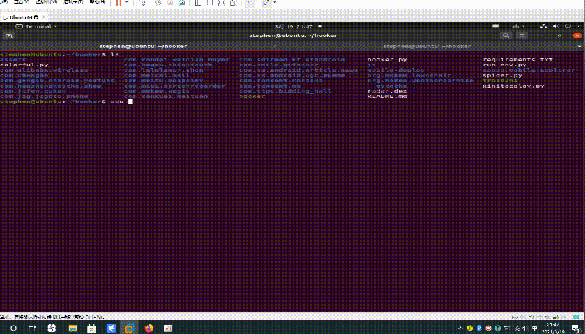
***

### 5. 部署之后手机的增强功能
- 1.关闭iptables防火墙，解决部分手机默认防火墙开启的问题
- 2.启动frida-server，如果你的手机是arm64他将优先启动arm64位的frida-server
- 3.在/data/mobile-deploy目录生成tools_env.rc 当你有内网穿透和网络服务转发、编辑文件、检测网络方面的需求时可以执行source /data/mobile-deploy/tools_env.rc，它将临时生成vi、telnet、frpc、tcpforward、ll命令以便你进行更便捷的开发，如图

***
- 4.启动网络adb，即你可以直接通过远程adb调试手机。例如:adb connect 192.168.0.105
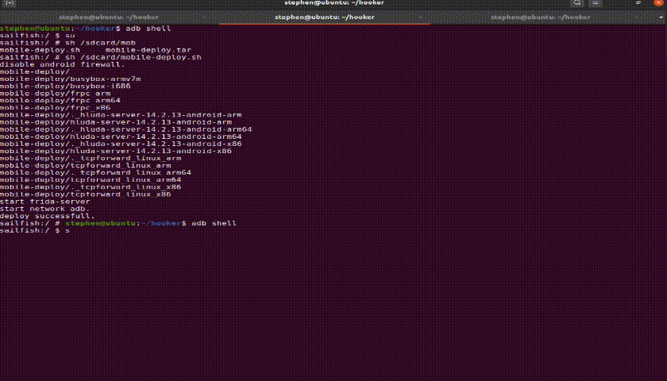
***


# 快速开始

### 1. 查看可调试进程
```shell
stephen@ubuntu:~/hooker$ ./hooker 
  PID  Name                           Identifier                                                   
-----  -----------------------------  -------------------------------------------------------------
 2857  Android Auto                   com.google.android.projection.gearhead                       
 1779  Android Services Library       com.google.android.ext.services                              
  929  Android 系统                     android                                                      
 5073  Carrier Services               com.google.android.ims                                       
11051  Device Health Services         com.google.android.apps.turbo                                
 2913  Device Personalization S…      com.google.android.as                                        
 2522  Google                         com.google.android.googlequicksearchbox                      
15189  Google Play 商店                 com.android.vending                                          
 2101  Google Play 服务                 com.google.android.gms                                       
 2833  Google VR 服务                   com.google.vr.vrcore                                         
 7710  Google 服务框架                    com.google.android.gsf                                       
 2546  NFC服务                          com.android.nfc                                              
  929  NetworkStack                   com.android.networkstack.inprocess                                                                   
  929  一体化位置信息                        com.android.location.fused                                   
14468  云端硬盘                           com.google.android.apps.docs                                 
14403  信息                             com.google.android.apps.messaging                            
12073  存储已屏蔽的号码                       com.android.providers.blockednumber                          
 1574  实时数据壁纸                         com.ustwo.lwp                                                
15637  抖音                             com.ss.android.ugc.aweme                                     
 2480  搜狗输入法                          com.sohu.inputmethod.sogou                                   
12073  用户字典                           com.android.providers.userdictionary                         
13362  电话                             com.google.android.dialer                                    
 1704  电话和短信存储                        com.android.providers.telephony                              
 1704  电话服务                           com.android.phone                                            
11818  知乎                             com.zhihu.android                                            
 1451  系统界面                           com.android.systemui                                         
12424  紧急警报                           com.android.cellbroadcastreceiver                            
12073  联系人存储                          com.android.providers.contacts                               
 1431  蓝牙                             com.android.bluetooth                                        
  929  设置存储                           com.android.providers.settings                               
10149  运营商设置                          com.google.android.wfcactivation                             
14376  通讯录                            com.google.android.contacts                                  
  929  通话管理                           com.android.server.telecom                                   
14807  阿里巴巴                           com.alibaba.wireless                                         
Enter the need to attach package.
: 
```

### 2. attach一个应用
```shell
stephen@ubuntu:~/hooker$ ./hooker
  PID  Name                           Identifier                                                   
-----  -----------------------------  -------------------------------------------------------------
15637  抖音                             com.ss.android.ugc.aweme                                     
 2480  搜狗输入法                          com.sohu.inputmethod.sogou                                   
12073  用户字典                           com.android.providers.userdictionary                         
13362  电话                             com.google.android.dialer                                    
 1704  电话和短信存储                        com.android.providers.telephony                              
 1704  电话服务                           com.android.phone                                            
11818  知乎                             com.zhihu.android                                            
 1451  系统界面                           com.android.systemui                                         
12424  紧急警报                           com.android.cellbroadcastreceiver                            
12073  联系人存储                          com.android.providers.contacts                               
 1431  蓝牙                             com.android.bluetooth                                        
  929  设置存储                           com.android.providers.settings                               
10149  运营商设置                          com.google.android.wfcactivation                             
14376  通讯录                            com.google.android.contacts                                  
  929  通话管理                           com.android.server.telecom                                   
14807  阿里巴巴                           com.alibaba.wireless                                         
Enter the need to attach package.
: com.ss.android.ugc.aweme  #在此处输入进程的Identifier即可调试应用
It's com.ss.android.ugc.aweme that you have attached app.
--------------------------------------------------
Please enter e, s, j, c or ex command.
a: Discovering activities.
b: Discovering services.
c: Discovering object. eg:'c {objectId}'
d: Object2Explain. eg:'d {objectId}'
v: Discovering view. eg:'v {viewId}'
e: Determines whether a class exists. eg:'e android.app.Application'
s: Discovering classes by a class'regex. eg:'s com.tencent.mm.Message.*'
t: Discovering offspring classes by a class'name. eg:'t com.tencent.mm.BasicActivity'
j: Generating hooked js. eg:'j okhttp3.Request$Builder:build'
k: Generating hooked the string generation js with a keyword. eg:'k {YourKeyword}'
l: Generating hooked the param generation js with a param keyword. eg:'l {YourKeyword}'
m: Discovering so module.
ex: Exit to the upper layer. eg:'ex'
: 
```
	提示1: 第一次调试你的应用时hooker将在当前目录生成以进程Identifier命名的应用专有工作目录，并初始化生成一些你可能会用到的通杀脚本。
	提示2: 成功attach一个应用时，命令将pause在等待输入调试指令的阶段。pause状态下使用命令进行高级调试请直接跳到


### 3. 应用工作目录
应用工作目录的意义在于提供一个的地方存放和管理frida脚本和快捷命令。hooker在你第一次调试应用时会创建应用工作目录，并初始化一些通杀脚本和快捷命令。

```shell
stephen@ubuntu:~/hooker/com.ss.android.ugc.aweme$ ls -l
total 784
-rw-rw-r-- 1 stephen stephen   7662 3月  16 20:55 activity_events.js
-rw-rw-r-- 1 stephen stephen   5790 3月  16 20:55 android_ui.js
-rwxrwxrwx 1 stephen stephen    102 8月   3  2020 attach
-rw-rw-r-- 1 stephen stephen   2242 8月   3  2020 click.js
-rw-rw-r-- 1 stephen stephen  12687 3月  23 22:23 com.bytedance.frameworks.core.encrypt.RequestEncryptUtils.js
-rw-rw-r-- 1 stephen stephen   4322 8月   3  2020 edit_text.js
-rwxrwxrwx 1 stephen stephen    159 8月   3  2020 hooking
-rwxrwxrwx 1 stephen stephen    101 8月   3  2020 kill
-rw-rw-r-- 1 stephen stephen 709448 3月  18 22:11 log
-rwxrwxr-x 1 stephen stephen     99 3月  16 20:55 objection
-rw-rw-r-- 1 stephen stephen   1226 3月  16 20:55 object_store.js
-rw-rw-r-- 1 stephen stephen   2553 3月  16 20:55 spider.py
-rw-rw-r-- 1 stephen stephen   2371 8月   3  2020 text_view.js
-rw-rw-r-- 1 stephen stephen   4789 3月  16 20:55 url.js
drwxrwxr-x 2 stephen stephen   4096 3月  25 21:21 xinit
-rwxrwxr-x 1 stephen stephen   5552 3月  16 20:55 xinitdeploy
```

# 应用工作目录的命令

### 1. hooking
hooking命令需要在后面跟一个脚本文件名作为参数，例如 ./hooking url.js。hooking实际上是在传统frida attach的基础上增加了将hook输出信息持久化到log文件中，比如当你hook一个调用非常频繁的函数比如某些字符串生成，输出的日志量无法短时间去全面，这时候你可以用文本编辑器打开log文件慢慢分析。以抖音工作目录为例，hooking实现如下

```shell
#!/bin/bash
HOOKER_DRIVER=$(cat ../.hooker_driver)
echo "hooking $1" > log
date | tee -ai log
frida $HOOKER_DRIVER -l $1 com.ss.android.ugc.aweme | tee -ai log
```


### 2. attach
attach同hooking类似，但是相比hooking少了日志持久化功能，这才是原生frida attach的命令。例如:./attach android_ui.js。以抖音工作目录为例，attach实现如下

```shell
#!/bin/bash
HOOKER_DRIVER=$(cat ../.hooker_driver)
frida $HOOKER_DRIVER -l $1 com.ss.android.ugc.aweme
```

### 3. objection
快捷执行objection调试命令，执行./objection即可。以抖音工作目录为例，objection实现如下

```shell
#!/bin/bash
HOOKER_DRIVER=$(cat ../.hooker_driver)
objection -d -g com.ss.android.ugc.aweme explore
```


### 4. xinitdeploy
xinitdeploy是用于部署资源的命令，它会把xinit目录下所放的文件拷贝到手机上/data/user/0/{packageName}/xinit/。同时保证资源文件的user/group权限和app进程是同一个临时用户。

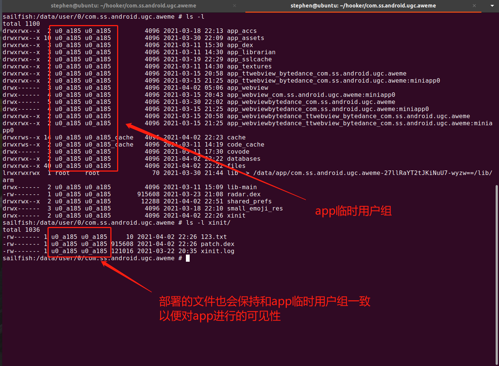

### 5. kill
如果你想重启app，先执行./kill会杀掉应用的主进程和所有子进程。作为一个Andrioid应用开发工程师出身，然后干到后台，接着干到爬虫，现在干到逆向的我必须告诉你：每个手机厂商都会实现一个自己的“内存清理”工具效果不一定好，且可能app本身也有保活机制。所以不建议你通过操作手机滑动进程列表来杀——有可能杀不干净。以抖音工作目录为例，kill实现如下:

```shell
#!/bin/bash
HOOKER_DRIVER=$(cat ../.hooker_driver)
frida-kill $HOOKER_DRIVER com.ss.android.ugc.aweme
```


# 应用工作目录的通杀脚本

### 1. url.js
需要跟踪url生成时可执行./hooking url.js


### 2. activity_events.js
当你需要跟踪start某个Activity启动时可执行，获取startActivity的intent信息和调用堆栈。/hooking activity_events.js


### 3. click.js
跟踪点击事件时可执行，并获取被点击View的真实VClass（很重要）。获取到了Class，你就可以在jadx找到这个View绑定事件代码。多一种办法定位到关键逻辑不好吗？一定要靠分析网络请求吗？条条大路通罗马，不一定非从网络库分析！ /hooking click.js
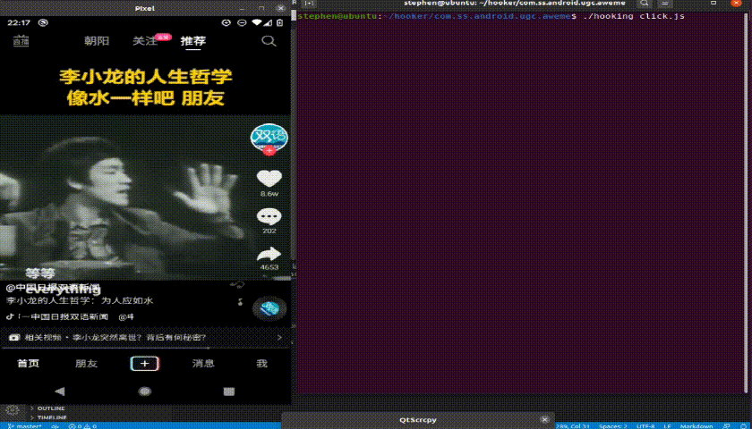

### 4. android_ui.js
封装一些操作原生Android UI的函数。如startActivity(activityName)、home()、back()、finishCurrentActivity()、clickByText(text) 等等，命令使用得用attach './attach android_ui.js' 原理是借助radar.dex作为代理操作Android原生View。（tag）
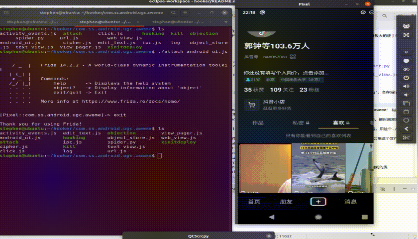
***

### 5. keystore_dump.js
在https双向认证的情况下，dump客户端证书为p12. 存储位置:/data/user/0/{packagename}/client_keystore_{nowtime}.p12 证书密码: hooker。原理是hook java.security.KeyStore的getPrivateKey和getCertificate方法，因为客户端向服务发送证书必调这个方法。
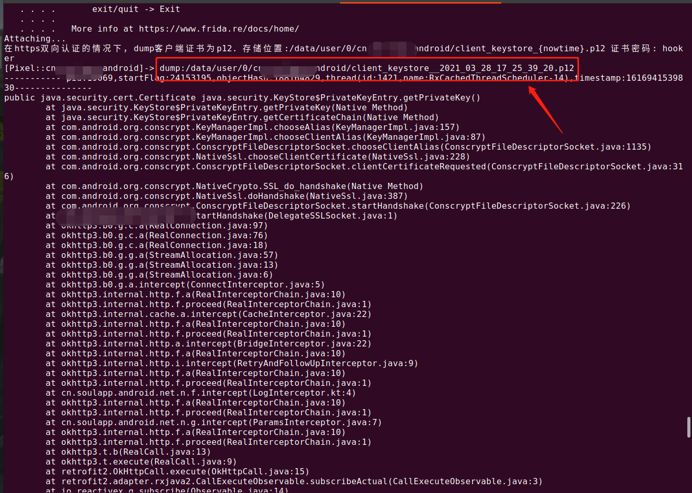

### 6. edit_text.js
跟踪获取Editview的getText()事件，并获取Editview的真实Class（很重要）。Editview一般绑定Search Action的实现代码，如果你抓取“搜索”接口。那么这个一定可以帮助你定位发送搜索请求的相关代码。多一种办法定位到关键逻辑不好吗？一定要靠分析网络请求吗？条条大路通罗马，不一定非从网络库分析！


### 7. text_view.js
跟踪TextView的setText和getText，获取TextView的真实Class。一般setText的堆栈信息会带出业务层的数据model处理逻辑，进而进一步分析到业务层数据bean封装类。
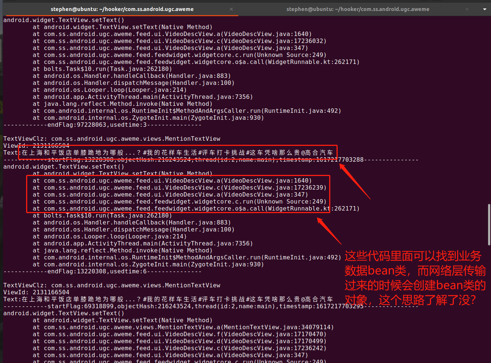

### 8. ssl_log.js
在native层跟踪ssl握手并记录CLIENT RANDOM，tcpdump出来的链路层pacp里面的TLS包可以用CLIENT RANDOM记录文件解出来，将在高级篇讲解使用步骤。

### 9. object_store.js
操作ObjectId标识的对象，根据自身分析情况可进行特定的序列化打印、操作对象的私有成员变量。将在高级篇讲解使用步骤。

# hooker调试命令行

### a - 打印Activity栈
打印Activity栈的所有实例，当前界面排最前面。你可以立刻获取当前手机界面的Activity实现类、继承关系、实现接口、Activity中的所有属性值和方法声明。配合jadx动静分析效果最佳，分析Activity对象的内部情况将极快的提供逆向的线索。值得注意的是Activity中每个成员变量hooker会分配一个ObjectId，这是为了让你用c命令对内部成员变量进行扫描的。


### b - 打印Service栈
打印Service栈的所有实例。和a命令一样，获取当前手机界面的Service实现类、继承关系、实现接口、Service中的所有属性值和方法声明。配合jadx动静分析效果最佳，分析Service对象的内部情况将极快的提供逆向的线索。值得注意的是Service中每个成员变量hooker会分配一个ObjectId，这是为了让你用c命令对内部成员变量进行扫描的。
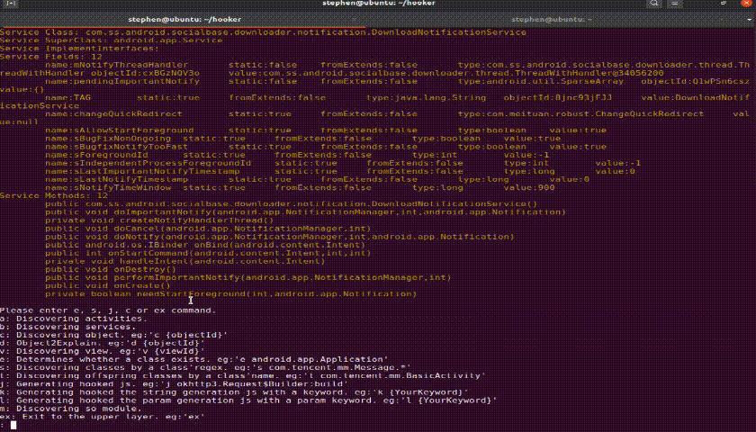

### c - 扫描指定Object
扫描指定ObjectId的对象，a、b命令扫描Activity和Service带出一托线索。结合jadx观察之成员变量的类型和值情况，你一定可以发现一些新的对象，想窥视之。那么请用c命令扫描吧，而c命令扫描完之后又会带出新的你感兴趣的线索（对象）。顺藤摸瓜，你可以找到很多有趣东西。


### d - 展开Object[]、List或Map
展开一个Object[]、List或Map，并以Index/key->value的形式打印出来，从而进一步获取集合对象内部的每个对象类型和ObjectId。比如我们通过a命令查看某Activity发现属性o是一个Fragment数组'name:o	static:false	fromExtends:false	type:[Landroidx.fragment.app.Fragment; objectId:tGErGHXLso	value:[Landroidx.fragment.app.Fragment;@94023208'，那么这个数组里面每个成员是什么我们就可以用d命令对其进行展开了。


### v - 以View的方式查看对象
以View的方式查看一个对象，除了有c命令全部的功能之外。v命令会先强转对象为View,然后获取view绑定的OnClickListener、OnLongClickListener、OnTouchListener、OnFocusChangeListener、OnEditorActionListener、OnItemClickListener等等，这些对象也将完全探测出来。比如对于属性:'name:h	static:false	fromExtends:false	type:com.ttpc.bidding_hall.weight.HomeTabButton	viewId:2131297762	objectId:GKuWPZOyY0	value:com.ttpc.bidding_hall.weight.HomeTabButton@227103246' 如下图用v命令查看我们可以发现HomeTabButton绑定了一个点击事件com.ttpai.track.g，这样的话你去jadx找到这个类就知道处理这个按钮的逻辑啦！！！此外，v 命令还可以跟上ViewId，但是ViewId对于每个View不一定都存在并且也不一定唯一，这个具体细节可以了解Android应用开发。


### e - 检测类在内存中是否存在
检测一个类在内存中是否存在。大部分情况下静态分析的类在内存中会存在，但是有时app会做热更新可能会出现类被替换的情况。作为一个严谨的逆向工程师在对类进行操作之前检测类是否存在内存中是个好习惯。如：e com.bytedance.frameworks.encryptor.EncryptorUtil 输出：True表示存在 False表示不存在
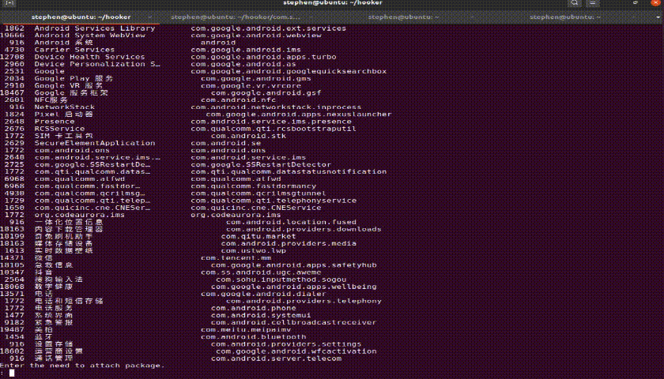

### s - 正则表达式扫描类
用正则表达式在内存中扫描类。比如你对某些关键词类感兴趣，完全可以使用s进行扫描。配合jadx查看类实现代码爽歪歪！当然jadx自带类搜索功能但是只是静态的，并且jadx搜索功能是吃内存的，没有32G内存使用起来好卡。这时候s命令或许你是不错的选择。
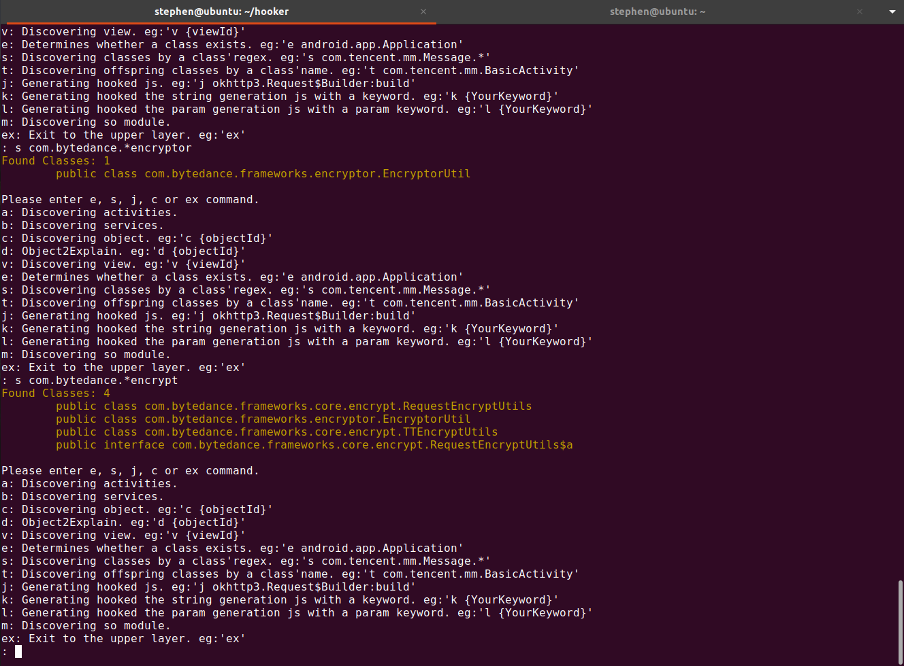

### j - 生成指定类的hook脚本
生成指定类名称的hook脚本，也是hooker最核心的功能之一。相比objection，hooker生成的脚本有标注生产脚本的apk版本和类名。并且每个方法内部已经具备打印堆栈的功能，包括调用时间、线程id、线程名、调用对象的hashcode，调用方法用时都有很详细的描述。
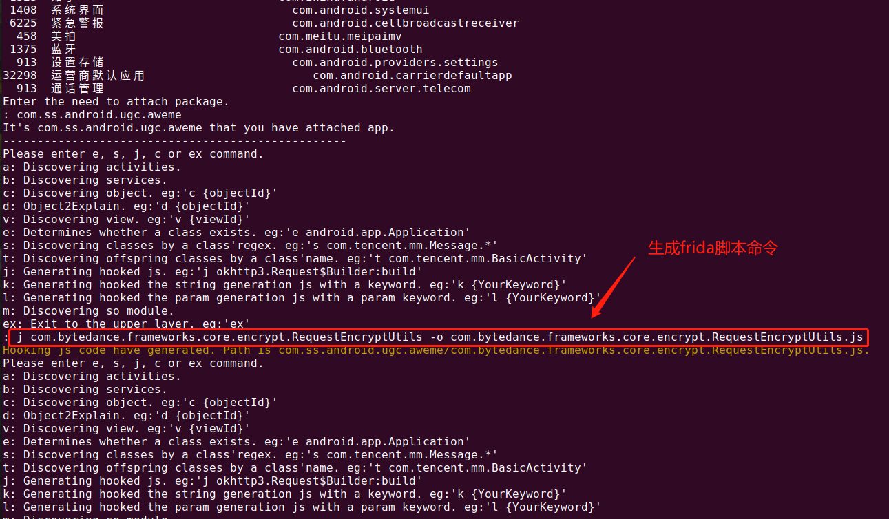
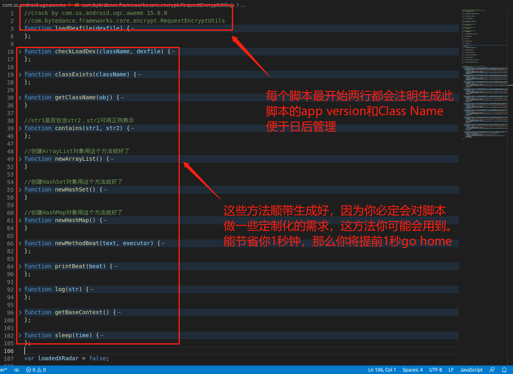

此脚本参考[RequestEncryptUtils.js](com.ss.android.ugc.aweme/com.bytedance.frameworks.core.encrypt.RequestEncryptUtils.js "RequestEncryptUtils.js")

hooker生成脚本和objection生成脚本优势对比

| 项目        | 生成脚本命令   |  能否打印堆栈  |  包含辅助方法  |  脚本版本信息注释  |  脚本可定制性  |
| --------   | -----:  | :----:  | :----:  | :----:  | :----:  |
| hooker      | j [class_name] -o [outputpath].js   |   能     |   包含     |   带apk version和生成命令     |   好     |
| objection        |   android hooking generate simple [class_name]  |   不能（白纸一张）   |   不包含     |   不带     |   一般     |


hooker高级应用
=================
hooker最核心的功能是自动化生产frida脚本，这个功能直接让很多写通杀脚本的同行“痛恨”我。因为我让那些懒人也能快速使用上自定义的脚本，而不再依赖于一些割韭菜大佬的通杀脚本了。这影响了他们卖网课的转化率，所以我想对那些大佬说：“对不起，我是故意的”。

## 脚本的内置函数
脚本是frida的核心，一个脚本不能只做打印堆栈信息的事情。我们还要进一步深挖脚本的潜在价值。比如我们改变被hook对象的内部成员变量的值、直接调用对象的方法、patch我们的dex。所以在hooker生成的每个脚本当中，我还内置了你可能需要用到的方法用于定制脚本。下面我就开始介绍这些方法的作用吧。

### 1. loadDexfile(dexfile)
加载一个dex文件到app进程中。dexfile是dex在手机上绝对路径，调用此方法必须保证dex文件用户和组权限对app进程的可见性。

### 2. checkLoadDex(className， dexfile)
先检测className是否存在内存中，如果不存在加载一个dex文件到app进程中。dexfile是dex在手机上绝对路径，调用此方法必须保证dex文件用户和组权限对app进程的可见性。

### 3. loadXinitDexfile(dexfile)
加载一个dex文件到app进程中。与loadDexfile、checkLoadDex不同，此方法直接从/data/user/0/{packageName}/xinit/路径下找dex文件。比如我们要加载上面基于[xinitdeploy](#4-xinitdeploy)命令部署的patch.dex，直接loadXinitDexfile("patch.dex");就可以给app进程注入dex了。到了这里你明白[xinitdeploy](#4-xinitdeploy)的良苦用心了没有！

### 4. loadXRadarDexfile()
加载radar.dex文件到app进程中。radar.dex内部包含操作java对象的增强功能，如果你需要使用fastTojson、getPrettyString、storeObjectAndLog等方法，必需在脚本加载时调用一次loadXRadarDexfile()。


hooker实战应用
=================

# https双向认证抓包

# ssl_log链路层离线抓包

# objectId的深度理解和灵活应用

# 内存漫游窥视对象内部数据

## 关于作者

```javascript
var author = {
  name  : "guozhong",
  bilibili : "https://space.bilibili.com/105035514",
  email : "1273568669@qq.com",
  experience : ["Android应用开发", "网络爬虫", "Android逆向", "JAVA/Go后台开发", "中间件开发"]
}
```

### End
[1]: https://github.com/frida/frida "frida"
